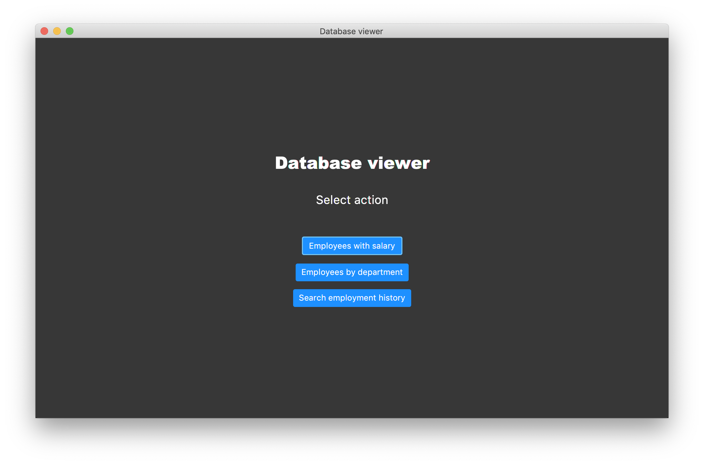
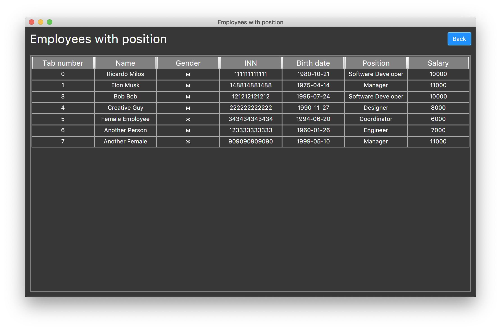
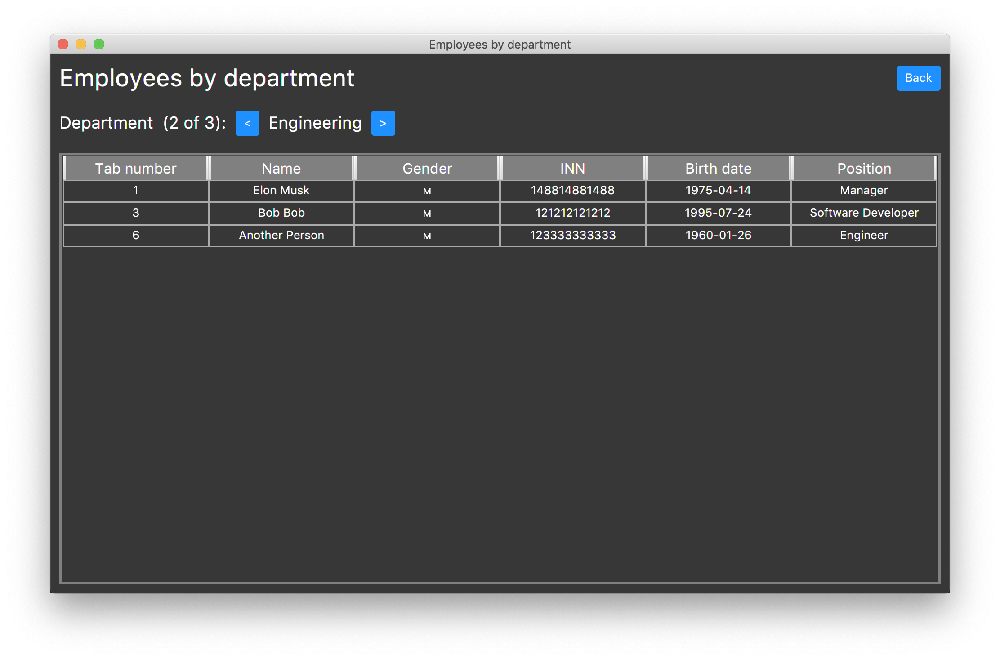
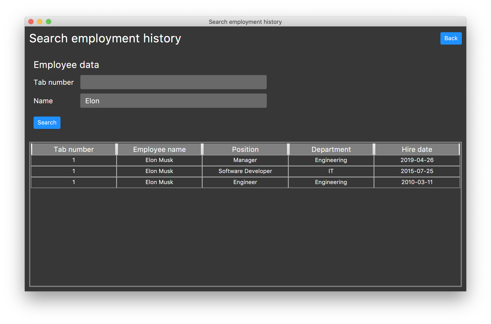

# database-viewer
This is simple application, written as university task on Kotlin with TornadoFX, for viewing database content.  


## Screens




## Usage
Run it with gradle
```
./gradlew run --args='<host:port> <database> <user> <password>'
```

Or build it
```
./graldew build
```

Then run
```
java -jar ./path/to/<file-name>.jar <host:port> <database> <user> <password>
```

I've already build it, check [Releases](https://github.com/EugeneTheDev/database-viewer/releases)